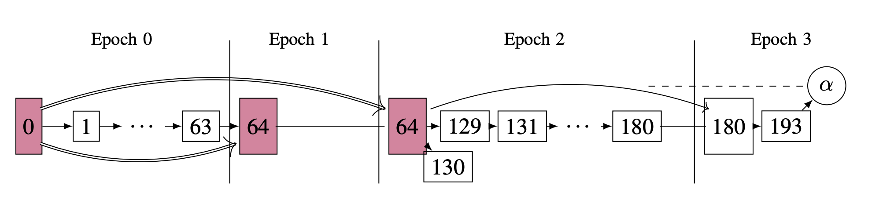
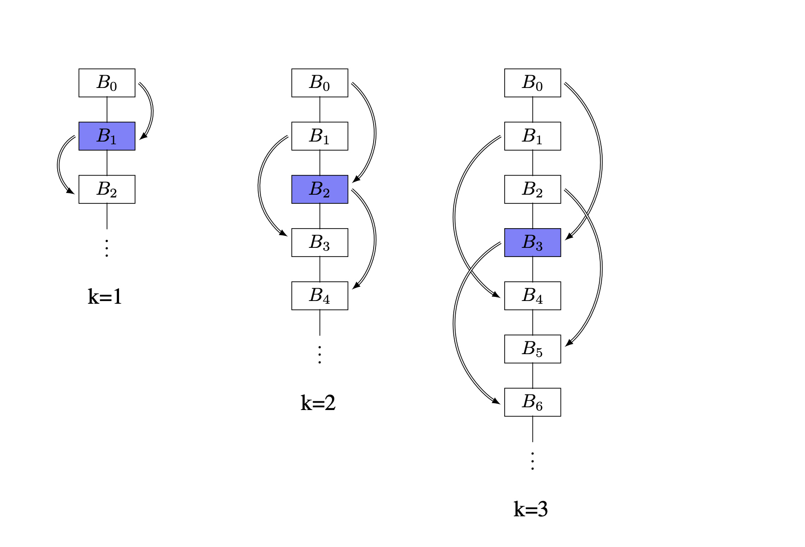
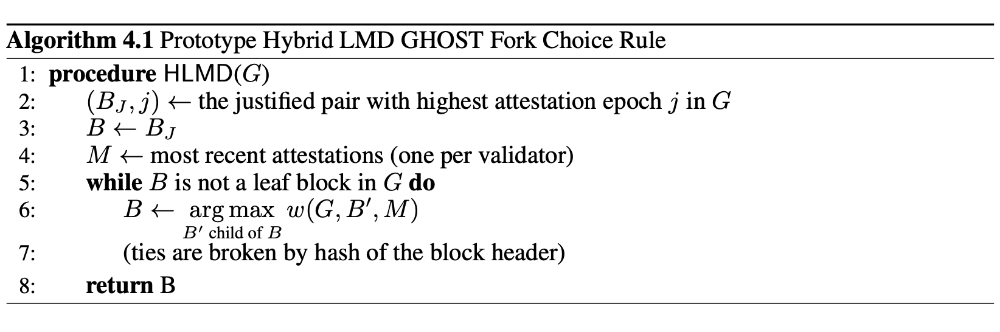
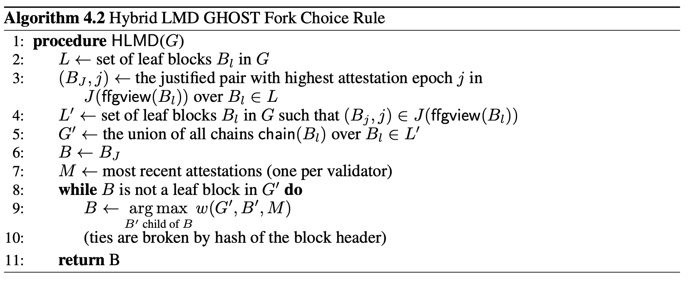

## 主要协议：Gasper

现在我们定义我们的主要协议 Gasper，它是 GHOST 和 Casper FFG 思想的结合。主要概念包括：

- 链的 _（时期边界）对（(Epoch boundary) pairs）_ ：给定⼀条链，会挑选出某些区块（理想情况下每个时期⼀个）来充当 Casper 的检查点 _（checkpoints）_。但是，⼀个区块可能会在同⼀条链上多次作为检查点出现（这是 Casper 中没有的细微差别；我们将在第 4.1 节中对此进⾏阐述），因此我们使⽤有序的 pairs (B, j)，来消除歧义，其中 B 是区块，j 是时期。这些将被称为时期边界对，或简称为对。
- _委员会（Committees）_ ：验证者在每个时期中被划分为委员会，每个插槽⼀个委员会。在每个插槽中，来⾃指定委员会的⼀名验证者会提出⼀个区块。然后，该委员会的所有成员将使⽤分叉选择规则 HLMD GHOST（LMD GHOST 的轻微变体）来证明他们所看到的链头（希望是刚刚提出的区块）。
- _证明和最终确定（Justification and Finalization）_ ：这些概念实际上与 Casper FFG 的概念相同，只是我们证明和最终确定对，⽽不是证明和最终确定检查点块，即，给定视图 G，J(G) 和 F(G) 是成对的集合。

### 4.1 时期边界块和对（Epoch Boundary Blocks and Pairs）

回想⼀下，任何特定的区块 B 都唯⼀地确定了⼀条链，即 chain(B)。对于区块 B 和时期 j，定义 EBB(B, j) —— 区块 B 的第 j 个时期边界区块，为 chain(B) 中最⾼插槽⼩于或等于 jC 的区块。让最新的此类区块为 LEBB(B)，或最后⼀个时期边界区块（B 的）。我们做了⼀些观察：

- 对于每个区块 B，EBB(B, 0) = Bgenesis。
- 更⼀般地，如果对于某个时期 j，slot(B) = jC，则 B 将成为包含它的每个链中的时期边界区块。
- 但是，如果没有这样的假设，⼀个区块可能在某些链中是时期边界区块，但在其他链中则不是。

为了消除此类情况的歧义，我们通过引⼊时期边界对（简称对）(B, j) 来提⾼精度，其中 B 是区块，j 是时期。我们的主要证明和最终化概念将基于这些对来完成。给定⼀个对 P = (B, j)，我们说 P 具有*证明时期 j（ attestation epoch j）*，使⽤符号 aep(P) = j，这不⼀定与 ep(B) 相同。

  
图 4：时期边界区块和对的⽰例。区块标有其插槽号。“63”不是实际的区块，但说明了 66 需要插槽 64 上的时期边界区块但未能找到的视⻆。

**⽰例 4.1。** 假设区块（以 slot 为标签）形成链 63 ← 64 ← 65，并且存在分叉 63 ← 66。那么 EBB(65, 1) = 64，因为 64 在 chain(65) 中。当我们尝试查找 EBB(66, 1) 时，我们会查找区块 64，因为我们处于时期 1，并且意识到它不在链(66)中，因此我们必须向后查找并从上⼀个时期中“拉出”区块 63，以作为这条链的时期边界区块。这在图 4 中⽤虚线部分表⽰。观察即使 aep(63, 1) 和 ep(63) = 0，ep() 也是⼀个仅依赖于块槽的局部属性，⽽像 aep() 这样的时期边界概念则依赖于链的上下文。  
**备注。** 我们进⼀步解释了为什么我们使⽤成对的区块⽽不是检查点区块。Casper FFG 是⼀种“最终性⼩⼯具”，这意味着它旨在在具有概率活性的区块链之上放置⼀层最终性，区块链提供稳定的新检查点区块供应。概率活性假设良好的同步条件。对于设计的安全性部分，我们希望做出更少的假设，并考虑最坏的情况，即我们可能会处于⼀段时间内没有看到新区块的状态。

例如，区块 B 可能是来⾃ epoch 1 的链头，但⽬前处于 epoch 3，且没有在 B 之上构建新区块。在原始 Casper FFG 中，我们期望概率活性，因此我们在每个 epoch 都会有⼀个不同的检查点。但是，当我们没有同步假设时，在分析中我们需要区分“epoch 2 中的检查点”和“epoch 3 中的检查点”的概念，即使两者的最佳候选都是 B，⽽ B 本⾝仍然只处于 epoch 1！这⾃然会引出概念 (B, 2) 和 (B, 3)，如果“应该在那⾥”的检查点区块缺失，则它们表⽰对后续 epoch 中检查点的最佳近似。

此外，Casper FFG 不对底层区块链中的时间做出任何假设只有区块⾼度很重要，没有插槽或时期的概念。在工作量证明区块链中，使用区块高度是一个自然的选择，因为挖掘新区块的[泊松过程](https://zh.wikipedia.org/zh-cn/%E6%B3%8A%E6%9D%BE%E8%BF%87%E7%A8%8B)在某种程度上起到了系统时钟的作用，而区块的出现时间相当不规则。作为⼀种权益证明协议，Gasper 可以将区块以受控的定期间隔作为协议的⼀部分（⽽不是依赖于随机过程）⽣成，因此协议中明确需要时间概念。为了捕捉这个时间概念，我们区块链中的每个对象⾃然需要了解数据（在区块中捕获）和时间（在时期计数中捕获），这也⾃然⽽然地引出了配对的概念。

### 4.2 委员会（Committees）

委员会的⽬的是在验证者之间分配职责。⾸先，假设验证者可以访问⼀系列随机⻓度为 N 的排列 $ρ0、ρ1、...$，作为函数 $\{1、2、...、N\} → \{1、2、...、N\}$。在本⽂的范围内，我们假设我们从随机预⾔机中获得这些随机排列。

召回时间被分为⼏个时期，每个时期有 $C$ 个插槽。每个排列 $ρj$ 将仅在时期 $j$ 期间使⽤。其作⽤是伪随机地将验证者选⼊ $C$ 个$委员会（committees）$，每个委员会负责⼀个时期的⼀个插槽。准确地说：

- 在时期 $j$ 期间，我们希望将验证者集合 $V$ 分成 $C$ 个⼤⼩相等的委员会 $S0, S1, . . . , SC−1$ （为了便于表⽰，我们假设 $C|N$；处理“大致相等”规模的委员会并不会改变我们方法的本质）。
- 因此，对于每个 $k ∈ \{0, 1, . . . , C −1\}$，我们将 $S$$k$ 定义为 $V$$ρj(s)$ 形式的 $N/C$ 验证者集合，其中 $s$ ≡ $k$ (mod $C$)。注意，对于时期 $j$，集合 $S0, S1, . . . , SC−1$ 根据需要将整个验证者集合 $\{V1, . . . , VN \}$ 划分到时期 $j$ 的所有插槽中。

总⽽⾔之，在每个时期 $j$ 中， $ρj$ 允许我们将验证者随机分配到 $C$ 个委员会中。我们的⼯作并没有假设超出这个直觉。

### 4.3 区块和证明（Blocks and Attestations）

现在，在每个插槽中，协议规定了分配给各⾃插槽的委员会的两种“委员会⼯作”：委员会中的⼀个⼈需要$提议（propose）$⼀个新区块，委员会中的每个⼈都需要证明他们的链头。提议区块和证明都意味着⽴即将相应的消息（分别为区块和证明）添加到验证者⾃⼰的视图中，然后将消息⼴播到⽹络。回想⼀下，提议（⾮创世）区块和发布证明的消息都有数字签名。

提议和证明都要求委员会成员在验证者⾃⼰的视图上运⾏相同的分叉选择规则 HLMD()，这是 LMD GHOST 分叉选择规则的变体。HLMD() 的定义需要我们尚未介绍的概念，因此我们将其定义推迟到第 4.6 节。⽬前，我们唯⼀需要知道的是，与 LMD GHOST ⼀样，HLMD() 接受视图 $G$ 并返回叶块 B 作为链的头部，使 chain(B) 成为 $G$ 的规范链。

我们现在介绍在插槽 $i = jC+k$ 期间协议的职责，其中 $k ∈ \{0, 1, . . . , C−1\}$。所有时间提及都是从验证者本地时钟的⻆度计算的，我们假设该时钟在某个增量内同步。

**定义 4.2。** 在插槽 $i = jC + k$ 的开始，指定验证者 $V = V$$ρj(k)$ ，即时期 $j$ 的委员会 $S$$k$ 的第⼀位成员，为该插槽的提议者$（proposer）$。提议者计算他/她认为的链的规范头，即 HLMD(view($V, i$)) = $B'$，然后提议⼀个区块 $(proposes\ a\ block)$ B，该区块是⼀条包含以下内容的消息：

1. slot(B) = $i$, 插槽号。
2. P($B$) = $B'$，指向⽗块的指针；换句话说，我们总是在链头顶部构建⼀个块
3. newattests($B$)，⼀组指向所有证明$(attestations)$（将在下⽂定义）的指针，$V$ 已经接受这些证明，但还未将其包含在作为 $B$ 祖先的区块 $B'$ 的任何 newattests($B'$) 中。
4. ⼀些特定于实现的数据（例如，如果我们正在追踪硬币，“Yunice 向 Brad ⽀付了 4.2 ETH”），其语义与我们⽆关。

对于依赖关系，$B$ 依赖于 $P(B)$ 和 newattests($B$) 中的所有证明。（例如，如果我们在⽹络上看到⼀个块，但看不到它的⽗块，我们会忽略该块，直到我们看到它的⽗块）。

在典型的（诚实）⾏为中，我们可以假设每个与区块关联的插槽号在 view(NW) 中也最多有⼀个这样的区块。默认情况下，$B$genesis 是具有插槽 0 的唯⼀区块。理论上，不诚实的验证者可以创建⼀个与现有区块具有重复插槽号的区块，但我们可以假设，⽤于区块提议选择的数字签名和伪随机⽣成器已经设置好，因此这种⾏为可以被可验证地捕获。例如，每次数字签名的区块进⼊验证者的视野时，验证者都可以⽴即检查区块提议者是否是被允许为相应插槽提议区块的唯⼀⼈员。验证者还可以通过仅指向两个区块来证明同⼀个⼈在同⼀个插槽中提出了两个区块。

**定义 4.3。** 在时间 $(i + 1/2)$，即插槽 $i = jC + k$ 的中间，委员会 $S$$k$ 中的每个验证者 $V$ 计算 $B'$ = HLMD (view($V,i + 1/2$))，并发布证明 $α$，该证明是⼀条包含以下内容的消息：

1. slot$(α) = jC + k$，验证者进⾏证明的插槽。我们还将使⽤ ep(α) 作为 ep(slot(α)) 的简写。
2. block$(α) = B'$ 。我们说 α 证明了 block(α)。我们将得到 slot(block(α)) ≤ slot(α)，并且“通常”通过快速证明刚刚在插槽中提议的块来获得相等。
3. 检查点边 LJ(α) → LE(α)。这⾥，LJ(α) 和 LE(α) 是 view($V,i + 1/2$) 中的时期边界对。我们将在第 4.4 节中正确定义它们。

对于依赖项，α 依赖于 block(α)。因此，我们会忽略证明，直到它所证明的区块被接受到我们的视图中（这是理论和实现之间的较⼤差异之⼀；我们将在第 8 节中对此进⾏更多讨论）。

直观地看，α 同时在做两件事：它既是其区块的“GHOST 投票”，也是两个时期边界对之间转换的“Casper FFG 投票”（类似于 Casper 的检查点区块）。

### 4.4 证明（Justification）

**定义 4.4。** 给定⼀个块 B，我们定义 view(B)，即 B 的视图，为依赖图中由 B 及其所有祖先组成的视图。我们定义 ffgview(B)，即 B 的 FFG 视图，为 view(LEBB(B))。

定义 view(B) 是“与查看者⽆关的”，其中任何接受 B 的视图都可以计算出相同的 view(B)，因此我们不需要在参数中提供验证者（或 NW）。直观地说，view(B) 将视图“聚焦”到 chain(B)，⽽ ffgview(B) 查看上⼀个检查点的 view(B) 的“冻结”快照。Casper FFG 仅在 epoch 边界对上运⾏，因此区块 B 的 FFG 视图会准确提取 chain(B) 中与 Casper FFG 相关的信息。  
现在我们来定义证明的主要概念。⾸先，回想⼀下 Gasper 的证明 α 包含⼀个检查点边 $LJ(α) \overset{V}{\rightarrow} LE(α)$，充当两个 epoch 边界对之间的“FFG 投票”。经过⼏个新的定义，我们终于可以明确地定义这些概念。  
**定义 4.5。** 如果检查点边缘 $(A, j') \overset{V}{\rightarrow} (B, j)$ 的证明的权重超过总权重的 $\frac{2}{3}$ ，我们就说存在从对$(A, j')$到对$(B, j)$的绝对多数链接。在这种情况下，我们写成 $(A, j') \overset{J}{\rightarrow} (B, j)$。  
**定义 4.6。** 给定⼀个视图 G，我们定义合理$（justified）$对的集合 $J(G)$ 如下：

- (Bgenesis, 0) ∈ J(G)；
- 若 $(A,j') ∈ J(G)$ 且 $(A,j') \overset{J}{\rightarrow} (B, j)$，则同样 $(B, j) ∈ J(G)$。

如果 $(B, j) ∈ J(G)$，我们说 B 在时期 j 内在 G 中是合理的。  
**定义 4.7。** 给定⼀个证明 α，令 B = LEBB(block(α))。我们定义：

1. LJ(α)，α 的最后一个合理对：ffgview(block(α)) = view(B) 中最高的证明时期（或最后一个）合理对。
2. LE(α)，α 的最后⼀个时期边界对： (B, ep(slot(α)))。

虽然我们为任何视图 G 定义 J(G)，但我们通常只对 G = ffgview(B) 的 J(G) 感兴趣。我们可以将每条链视为具有⾃⼰的合理区块/对的“状态”，并且仅在时期边界上进⾏更新。

  
图 5：验证者在周期 3 中写⼊证明时的视图 G。在周期 1 期间，延迟问题使她看不到任何区块，因此区块 64 既是 EBB(193, 1)，⼜是 EBB(193, 2)。她最终写⼊⼀个 α，其中对 block(α) = 193 投了“GHOST 票”，对 α 投了“FFG 票”检查点边 (单弧边) $(64, 2) \overset{V}{\rightarrow}(180, 3)$。我们使⽤区块的插槽编号，因此区块 0 就是 Bgenesis。红⾊块是合理的（在 G 中）。双边对应于绝对多数链接。

**例 4.8。** 验证者在其视图 G 上运⾏ HLMD(G) 以获取其链的头部，即区块 193。然后，她应该使⽤证明 α 来证明 193。  
在图 5 所⽰的 chain(193) 上，LE(α) = (180,3)，尽管 ep(180) = 2，因为我们的证明处于 epoch 3，⽽我们正在寻找 3\*64 = 192，但没有找到（可以想象，就像在我们的图中，我们“拉起”块 180 以显⽰它是 EBB(193,3))。在 ffgview(193) = view(180) 中，最后⼀个合理的（按时期编号，⽽不是插槽）对是 (64,2)，因此 LJ(α) = (64,2)。  
请注意，这依赖于 view(180) 包含指向 (64, 2) 的⾄少 $(2N/3)$ 权益的证明。有可能出现这种情况，即到 180 时这种情况没有发⽣，但到 193 时链确实看到了价值 $(2N/3)$ 的证明。在这种情况下，(64, 2) 在 J(G) 中，但 (64, 2) 不在 J(ffgview(193)) 中，则⽣成的检查点边将为 $(64, 1)\overset{V}{\rightarrow}(180, 3)$，假设 (64, 1) 的证明在 view(180) 中。如果 180 没有看到这些证明，检查点边甚⾄可能最终为 $(0, 0)\overset{V}{\rightarrow}(180, 3)$；请注意，如果 (64, 1) 的证明仅包含在从链 (193) 分叉的区块（例如区块 130）中，则这种情况⾮常有可能发⽣，因为分叉可能表⽰⽹络问题，导致这些证明暂时⽆法供链 (193) 上的验证者使⽤。

这⾥的⼀切都类似于 Casper FFG。block(α) 链内是⼀条由该链的 epoch 边界块创建的⼦链，从 Bgenesis 开始，到 B = LEBB(α) 结束。我们希望专注于这个区块⼦链（以对的形式表⽰，以允许边界情况），并⽤许多证明来证明时期边界对；这个⼦链正是 ffgview(block(α))) 所捕获的。α 是从某个最后证明的对 $(B', j')$ 过渡到新对 $(B, j)$ 的投票，可视化为检查点边 $(A, j')\overset{V}{\rightarrow}(B, j)$。如果此类投票的 $(2N/3)$ 权益价值发生，我们将创建一个绝对多数链接 $(A, j')\overset{V}{\rightarrow}(B, j)$ 并证明 $(B, j)$ 合理。

### 4.5 最终确定（Finalization）

考虑到我们的合理性$（justification）$概念和新的分叉选择规则，我们现在准备定义最终确定的概念。最终确定是一种更有力的合理性概念，因为当**任何**视图认为区块 B 已经对某个 j 最终确定时，**没有**视图将最终确定与 B 冲突的区块，除非区块链的 (1/3) 验证者是可以惩罚的。  
**定义 4.9。** 对于视图 G，我们说$(B$$0$$, j)$在 G 中已最终确定$（finalized）$（具体⽽⾔，$k-finalized$），如果$(B$$0$$, j)$ = (Bgenesis, 0) 或者存在整数 $k ≥ 1$ 且块 $B1, . . . , Bk ∈ view(G)$ 满⾜以下条件：

- $(B$$0$$, j),(B$$1$$, j + 1), . . . ,(B$$k$$, j + k)$ 是 chain(B$k$) 中相邻的时期边界对；
- $(B$$0$$, j),(B$$1$$, j + 1), . . . ,(B$$k$$−1, j + k − 1)$ 均在 $J(G)$ 中；
- $(B$$0$$, j)\overset{J}{\rightarrow}(B$$k$$, j + k)$。

我们将 F(G) 定义为视图 G 中已最终确定对的集合；我们还说，如果在某个时期 j 中 $(B, j) ∈ F(G)$，则块 B 已最终确定。

我们期望绝⼤多数情况下都能得到 1-finalized 块。具体来说，这仅意味着我们有块 $B$$0$ 和 $B$$1$ ，使得$(B$$0$$, j)$ 在 G 中是合理的，并且$(B$$0$$, j)\overset{J}{\rightarrow}(B$$1$$, j + 1)$，或者“⼀个合理的 epoch 边界块可以合理化下⼀个相邻的 epoch 边界块”。这基本上是 [[7](/README.md#7)] 中 最终确定$（finalized）$ 的原始定义。在 (1/2)-同步且没有⼲扰接受消息的实现细节的情况下，我们应该只会得到 1-最终化（1-finalization）。我们包含 $k > 1$ 的情况，以考虑网络延迟和证明包含延迟（参见第 8.3 节）相关的情况。

**备注。** 在图 6 中，我们看到了⼀些最终化的例⼦。在左侧，我们有 1-最终化（1-finalization），这是我们预计在绝⼤多数情况下会发⽣的情况。在中间，我们有⼀个 2-最终化（2-finalization）的例⼦，以解释证明延迟。$k = 3$ 的⽰例主要是为了说明；它需要⼀些⼈为的编排才能创建。实际上，[[11](/README.md#11)]中计划实现的最终化甚⾄不包括 $k ≥ 3$ 的最终化。请参阅第 8.5 节。

如果我们将⼀组区块 F 定义为最终确定并证明其安全性，那么即使我们将最终确定的定义更改为 F 的任何⼦集，安全性仍然⾃动保持正确，因为安全性是由缺少最终确定区块的不可⽐较的对定义的。因此，如果我们能够证明安全性，将⼀类⾮常通⽤的区块定义为最终确定并没有什么坏处。这就是我们在定义中包含所有 $k$ 的原因；更通⽤的定义更容易分析。

  
图 6：定义 4.9 的说明性⽰例，其中$k = 1, 2, 3$。双箭头表⽰绝对多数链接。蓝⾊块表⽰在每种情况下最终确定的块。

### 4.6 混合 LMD GHOST

我们现在有⾜够的符号来定义 HLMD。由于最终设计乍⼀看相当复杂，我们⾸先介绍算法 4.1，⼀个“原型”版本；简⽽⾔之，它从视图中最后⼀个合理的区块开始，然后运⾏ LMD GHOST。 $(B$$J$ $, j)$ 应该是唯⼀的这⼀点并不明显，但当区块链不是 (1/3)-可削减时，可以证明它是[引理 4.11](#4.11) 的结果，具有良好的定义。对于实现来说，添加决胜局（例如通过区块头哈希）是⽆成本的。

但是，使⽤此原型会遇到⼀些微妙的问题。由于证明的“FFG 部分”是时期边界对之间的投票，⽽ LJ($B$) 仅取决于 ffgview($B$)，我们可以将“链中最后⼀个合理对”视为在每个时期开始时“冻结”，这与“⾮冻结” $(B$$J$ $, j)$ 在本能地被定义为我们整个视图中的最后⼀个合理区块不相容，因为后者的定义可能会在时期期间发⽣变化（⿎励读者思考这⽅⾯的问题，作为⼀种练习）。因此，我们需要⼀个在时期中间不会发⽣变化的 $(B$$J$ $, j)$ 版本。

当算法分叉时，会出现另⼀个问题：分叉的区块可能具有截然不同的最后合理对，即使它们彼此相邻。由于这种不匹配，我们可以创建病态情况，如果验证者之前证明更⾼的最后合理时期，但随后分叉到最后合理时期更旧的链中，诚实的验证者可能会在遵循[定义 4.1](#4.10) 时削减⾃⼰（参⻅定义 4.10，S2）。

为了解决这些问题，⾸先我们将最新的合理对 $(B$$J$ $, j)$ 的状态“冻结”到每个时期的开始；正式地，这意味着在定义 $(B$$J$ $, j)$ 时，我们考虑 ffgview($B$$l$)在叶块 $B$$l$ 上的视图，⽽不是整个视图。然后，我们过滤分⽀，这样我们就不会沿着叶节点 $B$$l$ 的分⽀向下⾛，其中 LJ($B$$l$) 还没有“赶上” $(B$$J$ $, j)$；正式地，我们从 $G$ 中创建⼀个辅助视图 $G'$，以消除有问题的分⽀。这些修复产⽣了算法 4.2，即最终设计。

<!--  -->

理解算法 4.2 的双重（可能更简单）⽅法是从基于状态的协议实现的⻆度。我们可以将叶块 $B$$l$ 的每个链视为存储其⾃⾝最后⼀个合理对的状态。在⼀个时期内，链中块的新证明会更新 GHOST 相关的最新证明列表 $M$，但**不会**更新链的 FFG 相关证明和最终化信息，直到下⼀个时期边界块。这样，协议的“FFG 部分”始终与“冻结直到下⼀个时期”信息⼀起⼯作，⽽协议的“GHOST 部分”则通过证明不断更新。这种仔细的分离使我们能够避免因混合两个协议⽽导致的病理问题。

### 4.7 削减条件（Slashing Conditions）

在本节中，我们添加了削减条件，类似于[定义 3.1](/Main-Ingredients.md#3.1) 中 Casper 的削减条件。我们证明了⼏个所需的属性，之后我们准备在第 5 节中使⽤这些条件来证明 Gasper 的安全性。

**定义 4.10。**我们定义以下削减条件：

- (S1) 没有验证者做出两个不同的证明 $α1,α2$ ，其中 ep($α1$) = ep($α2$)。注意，此条件等同于 aep(LE($α1$)) = aep(LE($α2$))。
- (S2) 没有验证者做出两个不同的证明 $α1,α2$
  aep(LJ($α1$)) < aep(LJ($α2$)) < aep(LE($α2$)) < aep(LE($α1$))。

我们现在证明该协议的⼀个⾮常有⽤的属性：除⾮我们处于⼀种不太可能的情况，即我们有⾜够的证据来削减⾄少占总权益 1/3 的验证者，否则在视图 $G$ 中，我们可以假设 $J(G)$ 中的所有元素都有唯⼀的证明时期（换句话说，该视图每个时期最多看到⼀对被证明）。

**引理 4.11。**在视图 $G$ 中，对于每个时期 $j$，$J(G)$ 中最多有 1 对$ (B, j)$，否则区块链是 (1/3)-可削减的。具体来说，后⼀种情况意味着必须存在 $V$ 的 2 个⼦集 $V1,V2$ ，每个⼦集的总权重⾄少为 $2N/3$，使得它们的交集违反削减条件 (S1)。

_证明。_ 假设我们在 $J(G)$ 中有 2 个不同的对 $(B, j)$ 和 $(B', j)$。这意味着在时期 $j$ 中，超过 $2N/3$ 的总权益通过检查点边 $(B, j)$ 进⾏证明，并且超过 $2N/3$ 的权益通过检查点边 $(B', j)$ 进⾏证明。这些是我们期望的 $V1$ 和 $V2$。

**备注。** [引理 4.11](#4.11) 的重要性在于，假设条件合理（我们不是 (1/3)-可削减的），算法 4.2 中 $(B$$j$ $, j)$ 的选择是唯⼀的，因此定义明确。更⼀般地，我们可以假设任何视图在所有链上每个时期 $j$ 最多只能看到⼀个合理的对 $(B, j)$ 。  
**命题 4.12。** 遵循协议的诚实验证者永远不会意外违反削减条件。

_证明。_ ⾸先，请注意诚实的验证者不能违反 (S1)，因为每个验证者在每个时期只被分配到⼀个委员会，因此每个时期只被要求证明⼀次。因此，只需考虑 (S2) 即可。

假设诚实验证者 $V$ 即将在 $u$ 时期编写违反 (S2) 的证明。这意味着存在 $r < s < t < u$ 的时期，其中在 $t$ 时期，$V$ 编写了检查点边$(B$$2$$, s)\overset{V}{\rightarrow}(B$$3$$, t)$的证明 $αt$ ，并且协议现在告诉 $V$ 编写带有检查点边$(B$$1$$, r)\overset{V}{\rightarrow}(B$$4$$, u)$的证明 $αu$。这意味着在 $V$ 的当前视图上运⾏ HLMD GHOST 最终会到达某个叶块 $B$，⽽该叶块 $B$ 必须是 $B$$4$ 的后代，这样 LE($B$) = $(B$$4$ $, u)$。

因为 $V$ 在 $t < u$ 时期写了 $αt$ ，所以我们知道 $(B$$2$ $, s)$ 是 ffgview() 中某个叶块在 $t$ 时期的该点的合理对。由于合理块在其链增⻓时仍保持合理，我们知道现在在 $u$ 时期， HLMD GHOST（算法 4.2）中定义的起始合理对 $(B$$J$ $, j)$ 必须满⾜ $j ≥ s$。由于 $s > r$，我们知道 $j > r$。

然⽽，由于算法 4.2 中的过滤 $L'$，我们知道从 $(B$$J$ $, j)$ 开始运⾏ HLMD GHOST（在时期 $u$）所得到的叶块 $B$ 必须满⾜ $(B$$J$ $, j)$ $∈$ J(ffgview($B$))。因为根据定义 LJ($B$) $∈$ J(ffgview($B$)) 且 LJ($B$) = $(B$$1$ $, r)$，我们知道 $j ≤ r$，这是⼀个⽭盾。因此，协议不能强迫诚实的验证者违反（S2）。

### 4.8 奖励与处罚

验证者应该得到奖励（即增加质押），因为验证者可以在其提议的区块中包含有效的证明（在信标链规范[[11](/README.md#11)] 中，提议者奖励($proposer\ reward$)），或者在链增⻓过程中证明正确的区块并最终确定（在[[11](/README.md#11)] 中，证明者奖励($attester\ reward$)）。同时，验证者应该因违反削减条件⽽受到惩罚（减少质押）。

可以根据需要达到的安全级别调整奖励和惩罚⾦额，并且情况的博弈论应该是这样的，即验证者被激励执⾏其任务并且不违反削减条件。此外，值得考虑更复杂的激励措施，例如激励验证者抓住其他⾏为不当的验证者。虽然这可能会使博弈论⼯作变得有趣，但增加对这些参数的分析会分散本⽂的范围，我们希望重点关注 Gasper 的共识⽅⾯。为了务实，我们通过假设这些奖励和惩罚机制提供了⾜够的博弈论激励来抽象这种分析，以便以下情况成⽴：

- 诚实的验证者遵守协议。
- 任何诚实的验证者看到违反削减条件都会削减不诚实的验证者。
